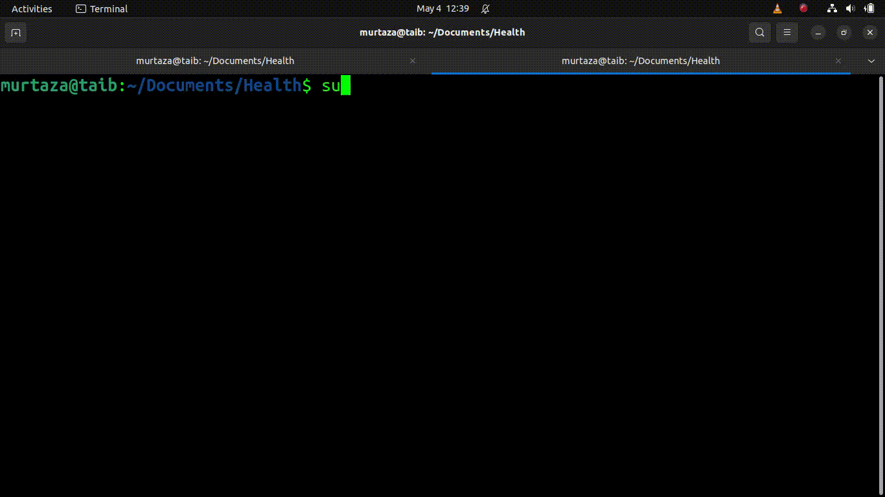

# Healthx Ventures Backend Project

### About

I developed Backend with **FastAPI** and **PostgreSQL**, this API features user and task management with **JWT authentication** and **bcrypt password hashing**. It supports user creation, task **CRUD** operations linked to users, and secure data handling via **psycopg2**.

# File Structure

```
├── Controller
│   ├── generateJWT.py
│   └── JWTCheck.py
├── Middleware
│   └── verifyPassword.py
├── Model
│   ├── connection.py
│   ├── healthXUser.py
│   └── healthXUserCRUD.py
├── Router
│   └── Users
│   │   ├── login.py
│   │   └── signUp.py
│   │
│   ├── Users_CRUD
│       ├── create.py
│       ├── delete.py
│       ├── read.py
│       └── update.py
├── .env
└── main.py
```

# Setup

```sh
$ git clone https://github.com/taib0101/Healthx-Ventures

$ sudo apt update

$ sudo apt install python3 python3-pip

$ pip install -r requirements.txt

$ echo "DataBase Connection URL" > .env

$ echo "PORT=8000" >> .env

$ python3 main.py development

```

# How It Works
## Database Connection 


## Create User


## User's CRUD
### Create


### Read


### Update


### Delete
